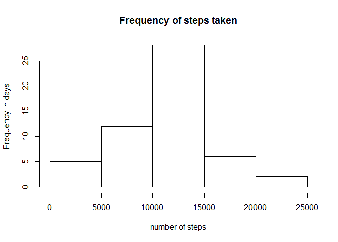
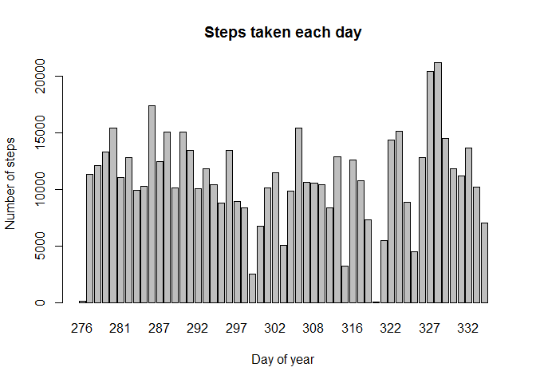
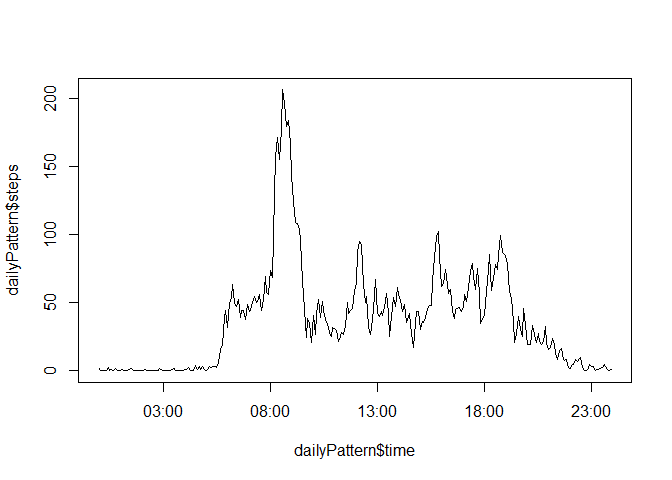
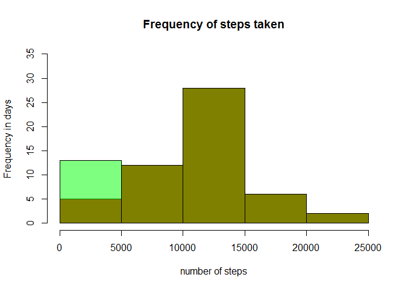
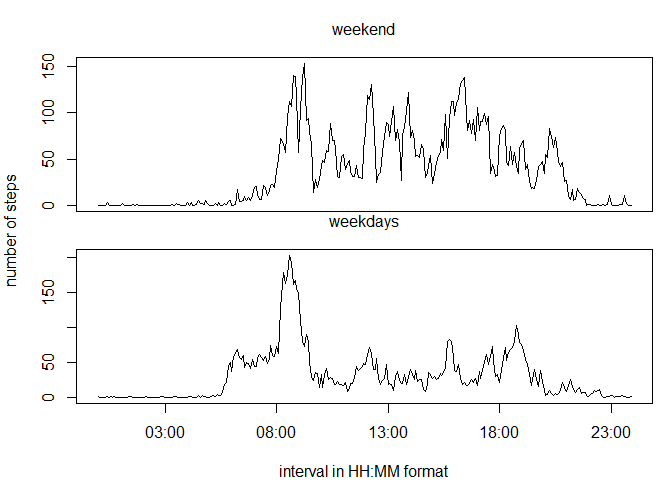

## Software environment

This assessment is prepared using the following details:


```r
        sessionInfo()
```

```
## R version 3.4.1 (2017-06-30)
## Platform: x86_64-w64-mingw32/x64 (64-bit)
## Running under: Windows 7 x64 (build 7601) Service Pack 1
## 
## Matrix products: default
## 
## locale:
## [1] LC_COLLATE=Spanish_Spain.1252  LC_CTYPE=Spanish_Spain.1252   
## [3] LC_MONETARY=Spanish_Spain.1252 LC_NUMERIC=C                  
## [5] LC_TIME=Spanish_Spain.1252    
## 
## attached base packages:
## [1] stats     graphics  grDevices utils     datasets  methods   base     
## 
## loaded via a namespace (and not attached):
##  [1] compiler_3.4.1  backports_1.1.0 magrittr_1.5    rprojroot_1.3-1
##  [5] tools_3.4.1     htmltools_0.3.6 yaml_2.1.14     Rcpp_0.12.12   
##  [9] stringi_1.1.5   rmarkdown_1.8   knitr_1.17      stringr_1.2.0  
## [13] digest_0.6.13   evaluate_0.10.1
```

## Loading and preprocessing the data

Read the activity.zip file, unzipping it in the same command, with header (steps date interval).
The stringsAsFactors option is set to FALSE, in order to read the dates (second column) as characters


```r
        activityData <- read.table(unz("activity.zip", "activity.csv"), header=T, quote="\"", sep=",", stringsAsFactors = FALSE)
```

then, the date and (time) interval columns are converted into a single column with date & time for plotting purposes. 
The time is codified numerically as HHMM is activity file, therefore, the numbers are reformatted into 4 digits with
sprintf("%04d", var) function and separated by ':' with sub function


```r
        formatedHourMinutes <- sub("(..)$", ":\\1",  sprintf("%04d", activityData$interval))
        fullDate <- paste0(activityData$date, 'T', formatedHourMinutes)
        activityData$fullDate <- as.POSIXlt(fullDate, format="%Y-%m-%dT%H:%M", tz = "UTC")
```

## What is mean total number of steps taken per day?

The total number of steps taken each day is calculated with the aggregate function, adding the steps 
of all the bins (5 minutes periods) for each day (same label in date column). Then, the histogram,
that provides the frequency of days of steps taken, in 5000 ranges, is plotted. 


```r
        stepsPerDay <- aggregate(steps ~ date, data = activityData, sum)
        hist(stepsPerDay$steps, main = 'Frequency of steps taken', xlab = 'number of steps', ylab = 'Frequency in days')
```

<!-- -->

And also the barplot is plotted, representing the distribution of total steps taken in those two months.
The day of year (doy, %j in strftime function) is used as label in the barplot. 


```r
        dayOfYear <- as.numeric(strftime(stepsPerDay$date, format = "%j"))
        barplot(stepsPerDay$steps, names.arg = dayOfYear, main = 'Steps taken each day', xlab = 'Day of year', ylab = 'Number of steps')
```

<!-- -->

Finally, the mean and median of the steps taken each day are calculated with functions mean and median respectively.


```r
        mean(stepsPerDay$steps)
```

```
## [1] 10766.19
```

```r
        median(stepsPerDay$steps)
```

```
## [1] 10765
```


## What is the average daily activity pattern?

The average daily pattern is calculated using the interval column to aggregate, or calculate the mean
to be more precise, all the days. Then the results are plotted against the same variable, but converted
into time (HH:MM format) for clearer plotting.


```r
        dailyPattern <- aggregate(steps ~ interval, data = activityData, mean)
        formatedHourMinutes <- sub("(..)$", ":\\1",  sprintf("%04d", dailyPattern$interval))
        dailyPattern$time <- as.POSIXlt(formatedHourMinutes, format="%H:%M")
        plot(dailyPattern$time, dailyPattern$steps, type = 'l')
```

<!-- -->

The 5-minute interval that contains the maximum number of steps is calculated by finding out the index
that correspond to the maximum of daily pattern. It is a reasonable time in the morning, indicating that
the subject goes to work walking.


```r
        format(dailyPattern$time[which(dailyPattern$steps == max(dailyPattern$steps))], format="%H:%M")
```

```
## [1] "08:35"
```

## Inputing missing values

The total number of rows with NA values is obtained by adding all the TRUE answers (value = 1) of the 
function is.na


```r
        sum(is.na(activityData$steps))
```

```
## [1] 2304
```

The NA values are replaced by 0, since it is the same that no value was acquired than no steps were taken.
A copy of the activity data is created by the function data.frame, and the NA values are replaced is this
new data set, named copyOfActivityData 


```r
        copyOfActivityData <- data.frame(activityData)
        copyOfActivityData$steps[is.na(copyOfActivityData$steps)] <- 0
```

The histogram of the new dataset yields:


```r
        newStepsPerDay <- aggregate(steps ~ date, data = copyOfActivityData, sum)
        p1 <- hist(stepsPerDay$steps, plot =  FALSE)
        p2 <- hist(newStepsPerDay$steps, plot =  FALSE)
        plot( p1, col='red', ylim = c(0, 35), main = 'Frequency of steps taken', xlab = 'number of steps', ylab = 'Frequency in days')  
        plot( p2, col=rgb(0,1,0,1/2), add=T)
```

<!-- -->

And its mean and median of the steps taken each day are:


```r
        mean(newStepsPerDay$steps)
```

```
## [1] 9354.23
```

```r
        median(newStepsPerDay$steps)
```

```
## [1] 10395
```

The differences observed in the histograms are in the first bin, as the previously discarded NA values, now appears as 0 in this bin
The mean and median values are different from the previous case.

## Are there differences in activity patterns between weekdays and weekends?

The new factor is created using the weekdays function, assigning weekday to 'lun', 'mar', 'mié', 'jue'
& 'vie' and weekend to 'sab' & 'dom'. Name of days are in spanish due to local preferences.
Again, the date and (time) interval columns are converted into a single column with date & time, The 
time is codified numerically as HHMM is activity file, therefore, the numbers are reformatted into 4 digits
with sprintf("%04d", var) function and separated by ':' with sub function.


```r
        formatedHourMinutes <- sub("(..)$", ":\\1",  sprintf("%04d", copyOfActivityData$interval))
        fullDate <- paste0(copyOfActivityData$date, 'T', formatedHourMinutes)
        copyOfActivityData$fullDate <- as.POSIXlt(fullDate, format="%Y-%m-%dT%H:%M", tz = "UTC")
```

The average weekday and weekend pattern is calculated using the interval column to aggregate, or calculate the mean
to be more precise, of the weekdays and weekend days subsequently. Then the results are plotted against the same variable, but converted
into time (HH:MM format) for clearer plotting.


```r
        weekdays <- weekdays(copyOfActivityData$fullDate, abbreviate = TRUE) %in% c('lun', 'mar', 'mié', 'jue', 'vie')
        weekend <- weekdays(copyOfActivityData$fullDate, abbreviate = TRUE) %in% c('sáb', 'dom')
        copyOfActivityData$dayOfWeek <- NA
        copyOfActivityData$dayOfWeek[weekdays] <- 'weekday'
        copyOfActivityData$dayOfWeek[weekend] <- 'weekend'
        par(mfrow=c(2,1))
        par(oma = c(3, 3, 2, 0))
        par(mar = c(1, 1, 1, 1))
        weekendPattern <- aggregate(steps ~ interval, data = copyOfActivityData[copyOfActivityData$dayOfWeek == 'weekend', ], mean)
        formatedHourMinutes <- sub("(..)$", ":\\1",  sprintf("%04d", weekendPattern$interval))
        weekendPattern$time <- as.POSIXlt(formatedHourMinutes, format="%H:%M")
        plot(weekendPattern$time, weekendPattern$steps, type = 'l',  xlab = '', ylab = '', xaxt = 'n')
        weekdayPattern <- aggregate(steps ~ interval, data = copyOfActivityData[copyOfActivityData$dayOfWeek == 'weekday', ], mean)
        formatedHourMinutes <- sub("(..)$", ":\\1",  sprintf("%04d", weekdayPattern$interval))
        weekdayPattern$time <- as.POSIXlt(formatedHourMinutes, format="%H:%M")
        plot(weekdayPattern$time, weekdayPattern$steps, type = 'l', xlab = '', ylab = '')
        mtext('interval in HH:MM format', side = 1, outer = TRUE, line = 2)
        mtext('number of steps', side = 2, outer = TRUE, line = 2)
        mtext("weekdays", side = 3, line = -10, outer = TRUE)
        mtext("weekend", side = 3, outer = TRUE)
```

<!-- -->

The plots show that the subject walks on weekdays morning but not much along the day. On the other hand, in weekend days the walking is distributed along the whole day, with a still observable peak in the morning. It can be inferred that the subject goes walking to work and it is probably in an office, sitting at a desk.
This concludes this assignment
